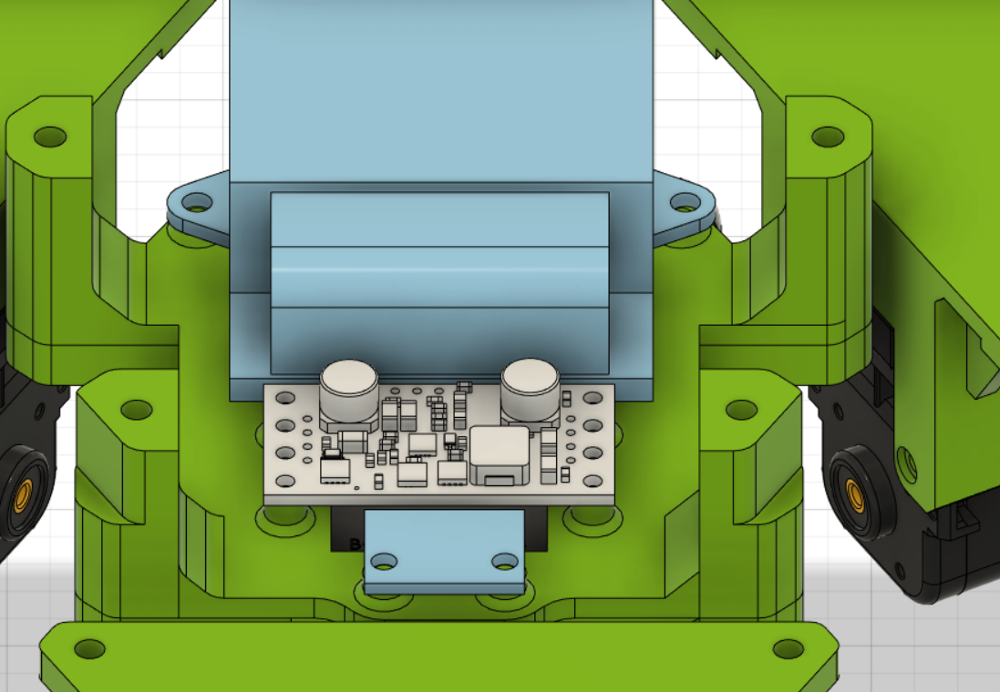
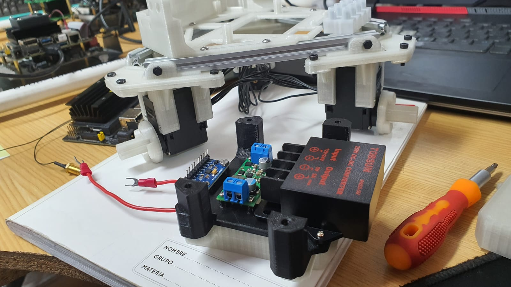
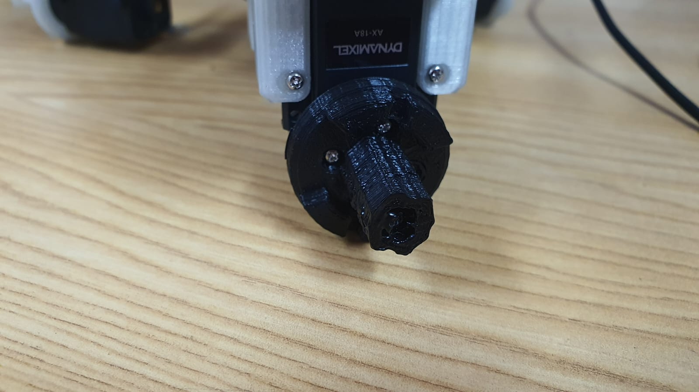
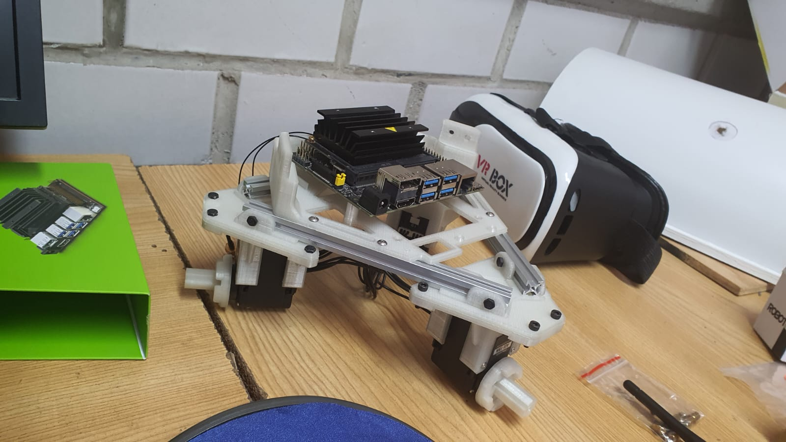

# Proyecto_4_sem_2023-1
# Armado e implementación de un robot móvil Nvidia Kaya

| Código | Description |
| ------:| ----------- |
| ***Asignatura*** | Robótica *2135* | 
| **Robótica-2023-I**  | Proyecto Nvidia Kaya |
| **IT102321-C002** | Sistema Ciber-Físico - Proyecto - Módulo  |

## Contenido

- [Objetivo](#objetivo)
- [Metas](#metas)
- [Productos](#productos)
- [Introducción](#introducción)
- [Desarrollo](#desarrollo)
- [Autores](#autores)
- [Referencias](#referencias)

## Objetivo
Implementar un robot Nvidia Kaya para la implementación de algoritmos de esquemas de navegación autónoma en un espacio determinado.

## Metas

- Armar el robot Nvidia Kaya.
- Implementar las herramientas de simulación del robot desarrolladas para la plataforma.
- Realizar una prueba de funcionamiento de la plataforma del robot.

## Productos

- Robot Nvidia Kaya
- Repositorio con archivos de prueba del robot.
- Simulación del robot navegando en un ambiente determinado.*

## Introducción

Dentro de la automatización inteligente se ha observado que los robots se han vuelto cada vez más omnipresentes en la vida diaria desde su fabricación hasta su uso comercial e industrial. Sin embargo, su desarrollo se torna complejo, lento, desafiante y costoso debido a los entornos y escenarios no estructurados en casos de uso.
Por esta razón, la empresa NVIDIA se ha especializado en el desarrollo de unidades de procesamiento gráfico y tecnologías de circuitos integrados para estaciones de trabajo como lo es el robot móvil “Kaya”, el cual se ejecuta en la plataforma NVIDIA Jetson NANO para implementar sistemas de inteligencia artificial [[1]](#1).

Entonces se puede decir que es un robot de código abierto, el cual es impulsado por una serie de aplicaciones empaquetadas con el SDK de Isaac y ejecutadas mediante la Jetson Nano para proporcionar un punto de partida accesible para el desarrollo de la robótica. Lo curioso de dicho robot es que se diseñó por medio de piezas impresas en 3D y componentes “básicos” con la finalidad de hacer un robot más accesible.

Kaya es un robot de tipo holonómico, es decir, es capaz de modificar su dirección de forma instantánea y sin la necesidad de rotar previamente gracias a que posee una unidad de tres ruedas [[2]](#2). Además, con ayuda de su cámara de profundidad RealSense le permite recibir información del entorno en el cual lo rodea con el fin de mapear, localizar y reconocer objetos. Aunado a lo anterior, la disposición de una IMU y de los motores de las ruedas permiten estimar la posición a través de la rotación de las ruedas a lo largo del tiempo [[3]](#3).

Existen diversas aplicaciones que puede realizar el robot, sin embargo, es de vital importancia conocer la manera en la cual se implementan las herramientas necesarias para su funcionamiento desde su cámara RealSense hasta el CAD requerido para simularlo en algún entorno de programación como lo es MATLAB. Por ello, el presente repositorio abordará dichas implementaciones para poner en funcionamiento al robot Kaya.

## Desarrollo

## Simplificación de polígonos sobre el CAD del ensamble

Para este punto es necesario disminuir considerablemente los polígonos con la finalidad de ahorrar recursos gráficos y de memoria a la hora de implementar el CAD en diferentes softwares de simulación que permitan analizar el comportamiento del robot móvil. La simplificación se llevó a cabo mediante los siguientes pasos:
1.  El CAD completo se encuentra en OnShape [[4]](#4), en el cual se descargaron únicamente las partes significativas del ensamble en formato “STEP”. Esto último es       esencial, pues las piezas se modificaron en SolidWorks para posteriormente realizar el urdf.

      Figura 1. CAD completo de la página OnShape.
                                                        
      
2.  En total se descargaron 4 piezas de subensamble, las cuales se debían modificar para lograr la disminución de polígonos. A la figura 2 se le retiró la plataforma de recogedor, tal y como se muestra en la figura 3.

Figura 2. Marco base original. 

Figura 3. Marco base modificado.

3. La figura 4 contenía la parte electrónica del robot, esto es: 
- Kit de desarrollo NVIDIA Jetson Nano
- Placa IMU Bosch
- Concentrador de potencia de 6 puertos
- Batería de iones de litio
- Regulador reductor de CC-CC de 5V 
- Interruptor

Figura 4. Parte electrónica.

   Por lo que modificar esta pieza fue fundamental a la hora de reducir polígonos.
    Cabe destacar que el regulador reductor de CC-CC de 12 V no se logró quitar del subensamble, debido a una restricción que venía desde la página OnShape, sin         embargo, la pieza no contenía polígonos considerables.

4. Con relación a la figura 5, solo se retiraron las antenas Wi-Fi de doble banda.

Figura 5. Cámara RealSense sin antenas WiFi.

5. Finalmente, el subensamble de las ruedas contenía la base del servomotor MX-12W unida a las llantas, por lo cual se tuvieron que separar con la finalidad de elaborar 2 archivos diferentes, los cuales permitieran generar movilidad en el entorno de simulación.

Figura 6. Base del servomotor con ruedas.

6. Al finalizar la modificación de las diferentes piezas, se procedió a ensamblar de tal forma que la “carcasa” y las “llantas” resultarán en dos ensambles diferentes listos para los archivos de simulación.

Figura 7. Carcasa ensamblada.

Figura 8. Ruedas ensambladas.

Cuando se obtuvieron las piezas deseadas se empleó el software Blender únicamente para corroborar la disminución de los polígonos trabajados. De esta manera, se realizó una comparativa del ensamble original al ensamble modificado, en el cual se observó una reducción de aproximadamente el 83% respecto al ensamble original, tal como lo muestran la figura 9 y 10.

Figura 9. Polígonos iniciales.

Figura 10. Polígonos finales.

Cabe mencionar que a lo largo del proyecto se estuvieron haciendo diversas pruebas para eliminar la mayor cantidad de polígonos presentes, por lo cual el presente repositorio tiene 2 carpetas de CAD. Sin embargo, las piezas finales y las descritas anteriormente se subieron como un Branch titulado “CAD-Simplificado-SOLIDWORKS” en la carpeta de “CAD-Simplificado” con el nombre de [`Kaya_STEP`](https://github.com/mrg-mex/Proyecto_4_sem_2023-1/tree/CAD-Simplificado-SOLIDWORKS/CAD_simplificado/Kaya_STEP).

Figura 11. Archivos de los ensambles finales del CAD.

Finalmente, se abrirán las piezas en SOLIDWORKS como se ve a continuación:

Figura 12. Carcasa en SOLIDWORKS.

Figura 13. Ruedas en SOLIDWORKS.

El siguiente paso para realizar es generar un archivo URDF, el cual permitirá describirlo mediante su modelo cinemático y dinámico del robot necesario para su simulación dinámica y control. Es fundamental considerar que no permite describir robots que no sigan una estructura tipo árbol y sus elementos no sean rígidos [[5]](#5).
Por lo anterior, se adjunta un video para generar dicho archivo con el CAD generado en la presente documentación.

Figura 14. Enlace para URDF.

# Instrucciones para la instalación del Visor Realsense 

El objetivo de este README es describir la instalación del visor Realsense que funciona con la cámara Intel D435i, con la que tendrémos la posibilidad de adquirir un sensado robusto en la profundidad de las imagenes aún estando en movimiento, esto gracias a la IMU que la cámara tiene integrada lo cual permite una calibración rápida cuando existe movimiento en el robot. Esta cámara es ideal para aplicaciones de seguimiento y reconocimiento de diversos elementos. 

Al término de esta instalación será posible comenzar a hacer pruebas en ROS.

## Instalación del Intercambiador de archivos (Swapfile)

Esto se realiza con la finalidad de evitar problemas en la demanda de la memoria en la Jetson Nano al momento de ejecutar el script de interés. 

Para su instalación será necesario abrir la terminal y copiar el respositorio de JetsonHacksNano (Autor del cual nos apoyamos para la instalación) llamado installSwapfile (Link: https://github.com/JetsonHacksNano/installSwapfile) y colocamos la siguiente instrucción: 

     $ git clone https://github.com/JetsonHacksNano/installSwapfile.git

Posteriormente tenemos que ejecutar las siguientes instrucciones: 

     $ cd installSwapfile/
     $ ./installSwapfile.sh

NOTA: Para esta instalación ocurría un problema similar al siguiente:

     Error: fallocate: fallocate failed: Text file busy.
     
Para su solución fue necesario emplear el siguiente comando: 

     sudo swapoff -a

Y posteriormente volver a colocar el comando $ ./installSwapfile.sh, así se solucionó este problema. 

## Instalación del Visor Realsense

Para esta instalación será necesario copiar de nuevo otro repositorio del mismo autor, el cual es installLibrealsense (Link: https://github.com/JetsonHacksNano/installLibrealsense), es un procedimiento bastante similar a lo anterior. Para eso colocaremos la sieuinte instrucción: 

     $ git clone https://github.com/JetsonHacksNano/installLibrealsense.git
     
Para posteriormente ejecutar la siguiente línea de código: 

     $ cd installLibrealsense/ 

En mi caso el comando para la instalación $ ./installLibrealsense.sh no se completó con éxito, lo cuál me detuvo totalmente en la instalación de la aplicación para poder visualizar las imagenes por parte de la cámara. Sin embargo una alternativa que funcionó con éxito fue el sigiuente comando: 

     $ ./buildLibrealsense.sh
    
Lo cual automáticamente instalaría este visor junto con todos su módulos y complementos. Esto tardó aproximadamente 1 hora. Cuando finalice la instalación será necesario reiniciar la placa para que todo funcione exitosamente. Para eso no es necesario utilizar la terminal, basta con ir al último icono de la parte superior derecha, colocar Shut Down y posteriormente "Reiniciar". 

Finalmente para poder ejecutar la aplicación se coloca la siguiente instrucción: 

     $ cd /usr/local/bin
     
Una ves dentro de esta ubicación colocamos la siguiente instrucción: 

     $ ./realsense-viewer/
     
La aplicación procedera a ejecutarse y verémos la siguiente interfaz:

Figura 15. Primera ejecución del visor Reasense

Para esto tenemos que tener conectada la cámara mediante algún puerto USB y automáticamente se reconocerá este dispositivo.

Del lado izquiero vemos la opción "RGB Camera", la resolución la cambiaremos a 1920 x 1080 y en "Avaiable Strams" en la opción "Color" seleccionaremos YUYV. Esto se ve de la siguiente manera: 

Figura 16. Configuración para visualización de imagenes 

Finalmente para activar la visualización tenemos que colocar "ON" en "RGB Camera", de la siguiente manera: 

Figura 17. Inicialización de la vista

INSERTAR IMAGEN DE VISTA NORMAL 

Figura 18. Visualización de las imagenes en tiempo real

Es así como logramos tener las primeras imagenes con esta cámara. 

Para poder explotar los recursos que nos brinda esta cámara y ver algunas otras herramientas de distancia procedemos a desplegar la opción que dice "Stereo Module" y habilitar "Infrared 1" e "Infrared 2", posteriormente damos "ON" teniendo lo siguiente: 

Figura 19. Configuración para vistas de distancia

Con esto podemos observar que nuestra pantalla principal se divide en 4 y tenemos las siguientes vistas con lo que se puede proceder a hacer las pruebas necesarias en ROS.

Figura 20. Vistas en tiempo real con las cámaras de profundidad

## Conclusiones

# Real Sense Viewer
Se pudo conluir exitosamente la instalación del visor realsense con el que se podrán hacer ensayos y pruebas con ROS para posteriormente generar el reconocimiento de trayectoria, objetos u otros elementos. Durante esta instalación se tuvieron problemas que no estaban documentados de acuerdo a las guías de JetsonHacksNano (Autor guía de la instalación) y por eso fue necesario emplear métodos ligeramente distintos de instalación que sirven como una alternativa en caso de que se encuentre el mismo problema en situaciones similares.

# Semestre 2023-2

## Reporte:

Nombres de los integrantes:
- Xavier Emmanuel Domínguez Grajales
- Mel Kluivert Russel Capcha Chanca
- Emilio Morales Luna
- David Essaú López González

En esta ocasión, antes de comenzar con la realización del proyecto, verificamos el número de piezas del robot y, que todas ellas, estén en condiciones óptimas y no existan faltantes.

El número de piezas correspondientes al chasís del robot es correcto. Todas tienen posibilidad de ser ensambladas, sin embargo, el primer inconveniente que se encontró fue el de los tornillos que se necesitarán para unir el Dynamixel MX-12W Servo Motor que se atornilla a las llantas. Logramos ver que la medida necesaria de tornillos que entrarán perfectamente en los orificios diseñados previamente son los M4.  

.jpeg?raw=true)
                                                                        Figura 1 Área de trabajo

Para continuar con una visualización del proyecto, será necesario realizar la transformación del documento de CAD a un formato que pueda ser leído por Fussion 360. Para esto, será necesario descargar el software del CAD para tener una mejor manipulación del modelo.

Una vez con nuestro modelos, vimos que habían cambios que hacer con alguos elementos del chasis.

                                                                              Figura 2 Fusion 360

El power bay que se había impreso no cumplía con los requerimientos que necesitábamos, ya que se tenía contemplado el componente Bosch GY-BMI160 6DOF IMU Board,
sin embargo sólo  poseíamos un MPU9250, que tiene medidas distintas. Por lo tanto la nueva IMU no satsifacía con los parámetros de diseño, por ello decidimos realizar un modelo en 3D con las medidas actualizadas y lo imprimimos. El resultado se adjuntará a la figura 3.

                                                      Figura 3 Electronic_Bay

También durante nuestras visitas, una pieza que va conectada al motor Dinamyxel y las llantas se perdió. Para ello tomamos el modelo de Fusion, buscamos la pieza que nos faltaba y lo exportamos a UltimakerCURA  entonces imprimimos nuestra pieza dando como resultado la siguiente figura. Una vez con esto hecho tomamos los tornillos M2 para unir nuetras piezas impresas con el motor Dinamyxel.

                                                          Figura 4 Componente_3D
Al ver la documentación revisamos las antenas, que tienen que estar conectadas a un módulo Wi-Fi, y éste módulo va conectado al Jetson. El proceso consiste en retirar la placa SOM, que se encuentra conectada al disipador de calor de la placa portadora (donde se encuentran los pines GPIO, conectores USB, etc.), una vez retiadaesa piezahí podemos conectar la placa Wi-Fi

Figura 5 Jetson
## Autores

| Iniciales  | Description |
| ----------:| ----------- |
| **EPM**  | Erik Peña Medina [GitHub profile](https://github.com/ErikFiUNAM) |
| **YGJ**  | Yeshua González Jiménez [GitHub profile](https://github.com/YeshuaGonzalez) |
| **LDBV**  | Leslie Dayana Bolaños Viquez [GitHub profile](https://github.com/lessliebv04) |
| **EVS**  | Eduardo Vega Solorzano [GitHub profile](https://github.com/eduVega1) |
| **KDR**  | Kevin De la Rosa Romero [GitHub profile](https://github.com/KevinDLRR) |
| **VSJE**  | Velazquez Sanchez Jose Emiliano [GitHub profile](pendiente) |
| **RIJL**  | Rivera Ibarra Juan Luis [GitHub profile](pendiente) |
| **EML**  | Emilio Morales Luna [GitHub profile](https://github.com/EngineerEmilio) |
| **XEDG**  | Xavier Emmanuel Domínguez Grajales [GitHub profile](https://github.com/Xavier-Grajales) |
| **XEDG**  | Mel Kluivert Russel Capcha Chanca [GitHub profile](https://github.com/Mel-Capcha-C) |

## Referencias

<a id="1">[1]</a>  "NVIDIA Isaac SDK". NVIDIA Developer. Available https://developer.nvidia.com/isaac-sdk (accedido el 17 de enero de 2023).

<a id="2">[2]</a>   SA. "Sistemas holonómicos". Electric Bricks. Available http://blog.electricbricks.com/2010/07/sistemas-holonomicos/ (accedido el 17 de enero de 2023).

<a id="3">[3]</a>   "NVIDIA Kaya — ISAAC 2021.1 documentation". NVIDIA Documentation Center | NVIDIA Developer. Available https://docs.nvidia.com/isaac/doc/tutorials/assemble_kaya.html (accedido el 17 de enero de 2023).

<a id="4">[4]</a>   "Onshape". NVIDIA Kaya Robot. Available https://cad.onshape.com/documents/03aa2560e7a40b2b7da40e12/w/001dbb6db63b0092c9ea5823/e/37043abce9062fab02c40889 (accedido el 17 de enero de 2023).

<a id="5">[5]</a>   R. Martín Batanero y J. Pomares Baeza. "ROS para la simulación de exoesquleto". RUA: Principal. Available https://rua.ua.es/dspace/bitstream/10045/116947/1/Ros_para_la_simulacion_y_control_de_exoesqueletos_Martin_Batanero_Raul.pdf (accedido el 17 de enero de 2023).
